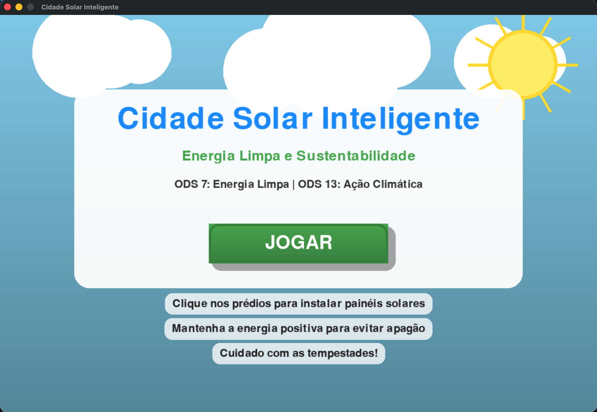
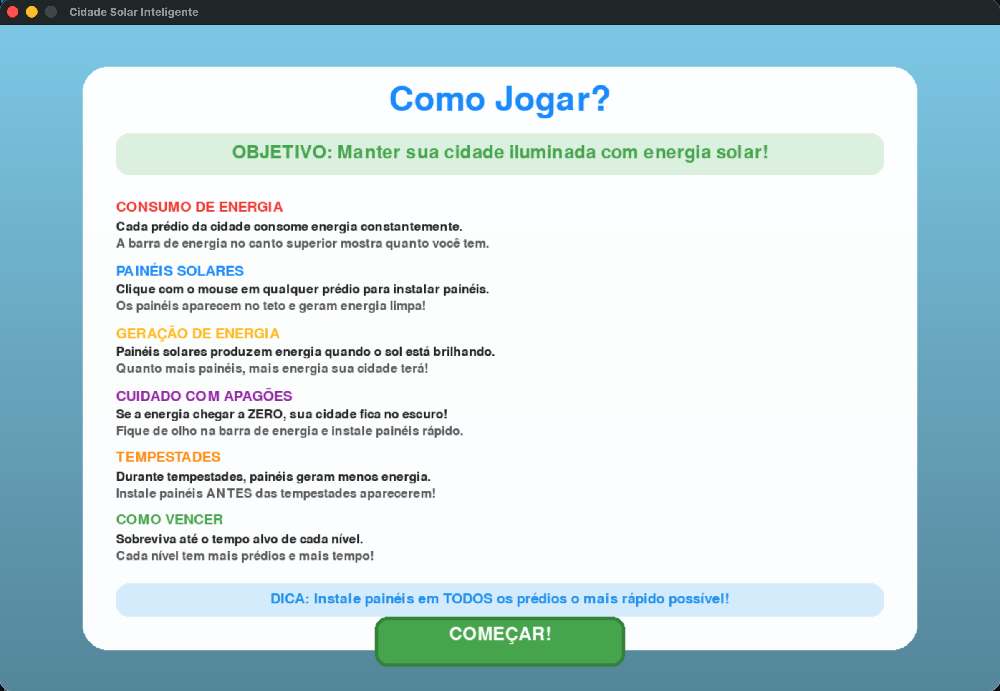
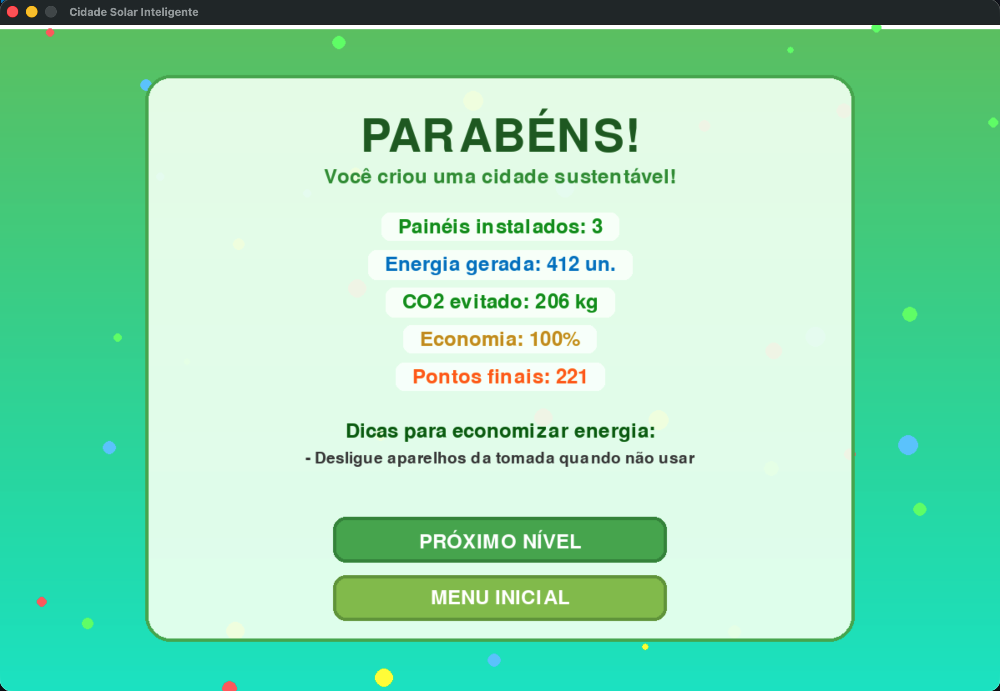
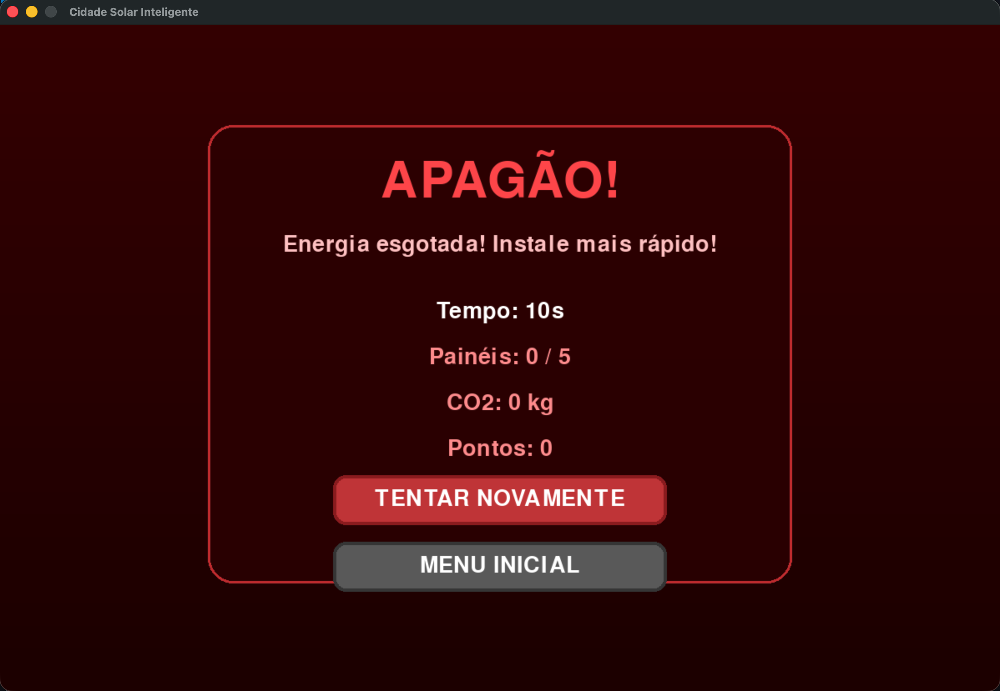

# Cidade Solar Inteligente

> Um jogo de simulação e estratégia focado em sustentabilidade, energia limpa e gestão de recursos.


## Sobre o Projeto

**Cidade Solar Inteligente** é um jogo educativo desenvolvido para demonstrar na prática a importância da energia renovável. O jogador assume o papel de gestor de uma cidade e deve evitar o "apagão" instalando painéis solares em tempo real para suprir a demanda crescente de energia.

O projeto foi desenvolvido alinhado com os **Objetivos de Desenvolvimento Sustentável (ODS)** da ONU:

**ODS 7:** Energia Limpa e Acessível. <br>
**ODS 13:** Ação Contra a Mudança Global do Clima.

---

## Como Jogar

O objetivo é simples: **Não deixe a energia acabar!**

1.  **Instale Painéis:** Clique nos prédios (casas, escolas, fábricas) para instalar painéis solares.
2.  **Gerencie o Tempo:** A barra de energia cai constantemente devido ao consumo da cidade.
3.  **Enfrente a Tempestade:** Eventos climáticos reduzem a eficácia do sol. Esteja preparado!
4.  **Vença:** Chegue ao final do cronômetro com energia positiva e todos os prédios equipados.

### Níveis de Dificuldade

🟢 **Nível 1 (Fácil):** Poucos prédios, consumo baixo. Ideal para aprender. <br>
🟡 **Nível 2 (Médio):** Mais prédios, consumo acelerado e energia inicial reduzida. <br>
🔴 **Nível 3 (Difícil):** Zona industrial com alto consumo. Requer cliques rápidos e estratégia!

---

## Screenshots

### Menu Principal e Tutorial

<div style="display: flex; justify-content: space-between;">
  
  
</div>

### Vitória e Derrota

O jogo possui feedback visual e sonoro para cada resultado:

<div style="display: flex; justify-content: space-between;">
  
  
</div>

---

## Como Rodar o Jogo

Siga os passos abaixo para rodar o projeto na sua máquina:

### Pré-requisitos

Ter o [Python](https://www.python.org/) instalado.
Ter a biblioteca `pygame` instalada.

### Instalação

1. **Clone o repositório:**
   ```bash
   git clone https://github.com/semellicodes/pygame-projeto.git
   ```
